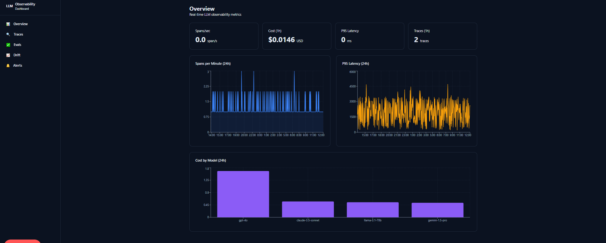
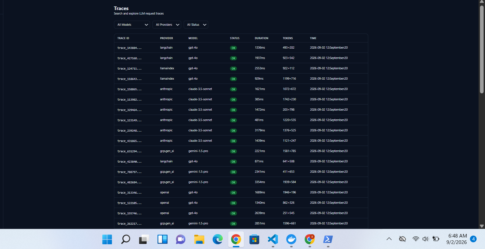
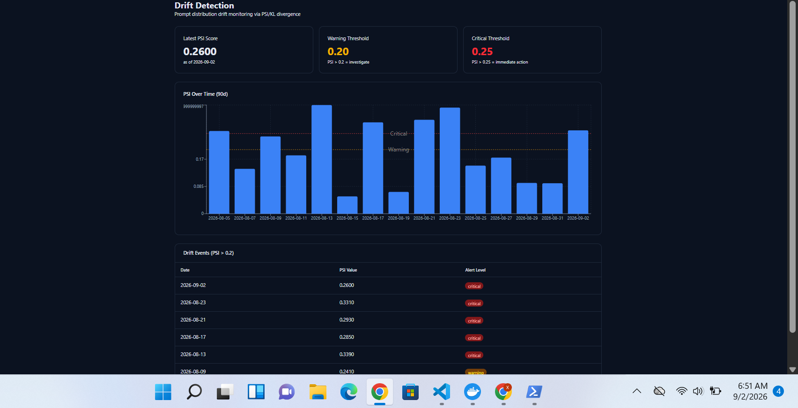
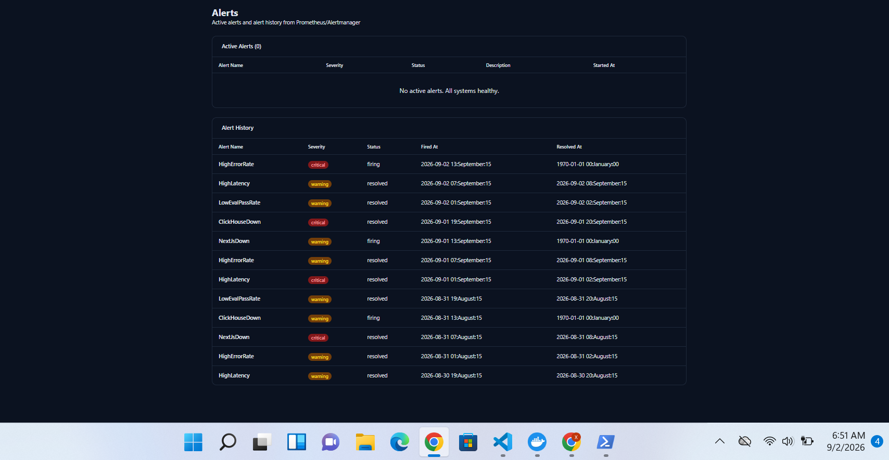
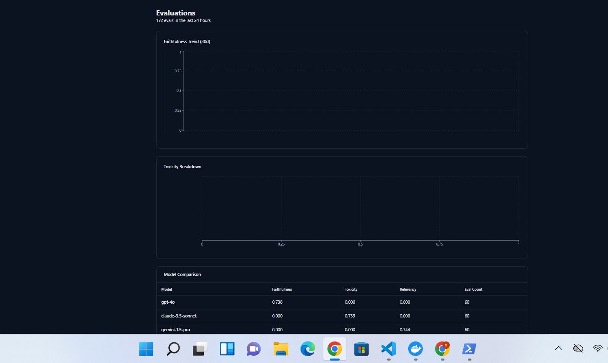
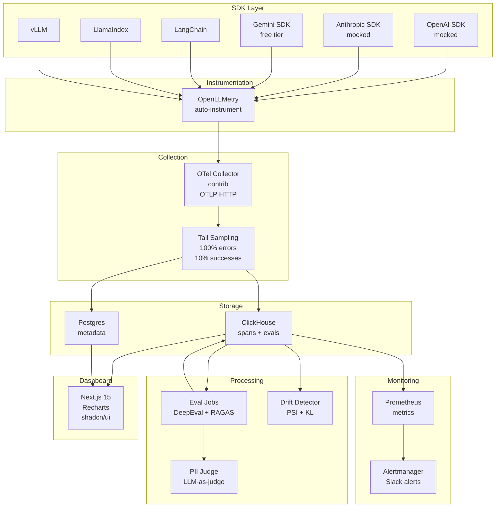

# Local LLM Eval & Observability Dashboard

> Self-hosted observability platform for LLM applications — traces, evals, drift detection, and alerting in one command.

[](https://www.docker.com/)
[](https://nextjs.org/)
[](https://clickhouse.com/)
[](LICENSE)
[](CONTRIBUTING.md)

<p align="center">
  
</p>

A production-grade observability stack for teams shipping LLM applications. It ingests OpenTelemetry GenAI traces from 6 SDK families, stores them in ClickHouse for sub-second analytics, runs automated evals (DeepEval, RAGAS, custom PII judges), detects prompt drift via PSI/KL divergence, and fires alerts through Prometheus/Alertmanager — all behind a single `docker compose up`.

Built for engineers who need to answer: *what is my model doing in production, is it getting worse over time, and when something breaks, how fast can I see it?*

**Quick Start:**
```bash
git clone https://github.com/yourusername/llm-observability-dashboard.git
cd llm-observability-dashboard
cp .env.example .env
docker compose up
# Open http://localhost:3000
```

---

## What It Looks Like

### Traces
Searchable, filterable trace table with model, provider, status, duration, and token usage — drill down into any trace for a full span-by-span waterfall.

<p align="center">
  
</p>

### Drift Detection
Population Stability Index (PSI) and KL divergence tracked over time, with hard thresholds at 0.20 (warning) and 0.25 (critical). Drift events below are flagged for investigation.

<p align="center">
  
</p>

### Alerts
Active alerts at the top, full historical timeline below — every firing and resolved event from Prometheus/Alertmanager, with severity, status, and timestamps.

<p align="center">
  
</p>

### Evaluations
LLM-as-judge scores (faithfulness, toxicity, answer relevancy, PII) with 30-day trends, category breakdown, and a per-model comparison table.

<p align="center">
  
</p>

---

## Architecture



---

## Features

### Dashboard Pages

| Page | What It Shows |
|------|---------------|
| **Overview** | Spans/sec, cost/user, p95 latency KPI cards + time-series charts |
| **Traces** | Searchable/filterable trace table with drill-down to waterfall view |
| **Trace Detail** | Span waterfall showing parent-child relationships |
| **Evals** | Faithfulness trend, toxicity breakdown, model comparison |
| **Drift** | PSI over time with threshold lines at 0.2 and 0.25 |
| **Alerts** | Active alerts table and alert history timeline |

### SDK Coverage

| SDK | Status | Traces |
|-----|--------|--------|
| OpenAI | Mocked (free) | ✅ |
| Anthropic | Mocked (free) | ✅ |
| Google Gemini | Real (free tier) | ✅ |
| LangChain | Mocked | ✅ |
| LlamaIndex | Mocked | ✅ |
| vLLM | Mocked | ✅ |

### Eval Metrics

- **Faithfulness**: Is the response grounded in context?
- **Toxicity**: Does the response contain harmful content?
- **Answer Relevancy**: Does the response address the question?
- **Context Precision**: How relevant is the retrieved context? (RAGAS)
- **Context Recall**: Does the context cover the needed information? (RAGAS)
- **PII Detection**: Custom LLM-as-judge for PII exposure

### Alert Rules

| Alert | Condition | Severity |
|-------|-----------|----------|
| High Error Rate | >5% errors for 5 min | Critical |
| High Latency | P95 > 2s for 5 min | Warning |
| Low Eval Pass Rate | <80% for 10 min | Warning |
| ClickHouse Down | Unreachable for 2 min | Critical |
| Next.js App Down | Unreachable for 2 min | Critical |

---

## Tech Stack

| Component | Technology | Why |
|-----------|-----------|-----|
| Dashboard | Next.js 15, Recharts, Tailwind CSS | Server Components, SSR-compatible charts |
| Trace Store | ClickHouse | Columnar OLAP, 92% compression, sub-second aggregations |
| Metadata Store | Postgres | ACID transactions for users, API keys, pricing |
| Instrumentation | OpenLLMetry | CNCF standard, auto-instruments 6+ SDK families |
| Collection | OTel Collector (contrib) | Tail sampling, batching, memory management |
| Evals | DeepEval, RAGAS | LLM-as-judge, RAG evaluation |
| Drift Detection | sentence-transformers, PSI | Embedding-based distribution shift detection |
| Alerting | Prometheus, Alertmanager | Industry standard, battle-tested |

---

## Setup

### Prerequisites

- Docker and Docker Compose
- (Optional) Google API key for real Gemini traces

### Steps

1. **Clone the repository**
   ```bash
   git clone https://github.com/yourusername/llm-observability-dashboard.git
   cd llm-observability-dashboard
   ```

2. **Configure environment**
   ```bash
   cp .env.example .env
   # Edit .env with your settings (defaults work for local dev)
   ```

3. **Start the stack**
   ```bash
   docker compose up -d
   ```

4. **Verify services**
   ```bash
   docker compose ps
   # All services should show "healthy"
   ```

5. **Run SDK clients** (to generate traces)
   ```bash
   pip install -r sdk-clients/requirements.txt
   python sdk-clients/openai/run.py
   python sdk-clients/anthropic/run.py
   # etc.
   ```

6. **Open the dashboard**
   ```
   http://localhost:3000
   ```

### Available Commands

| Command | Description |
|---------|-------------|
| `make up` | Start all services |
| `make down` | Stop all services |
| `make logs` | View logs |
| `make status` | Check service health |
| `make build` | Rebuild and restart |
| `make clean` | Remove all data |

---

## Project Structure

```
├── dashboard/              # Next.js 15 app
│   ├── app/                # App Router pages
│   │   ├── (app)/          # Dashboard layout
│   │   │   ├── dashboard/  # Overview page
│   │   │   ├── traces/     # Traces + detail pages
│   │   │   ├── evals/      # Evals page
│   │   │   ├── drift/      # Drift page
│   │   │   └── alerts/     # Alerts page
│   │   └── api/metrics/    # Prometheus metrics endpoint
│   ├── components/         # Shared components
│   └── lib/                # ClickHouse client + services
├── sdk-clients/            # Instrumented SDK clients
│   ├── openai/             # OpenAI (mocked)
│   ├── anthropic/          # Anthropic (mocked)
│   ├── gemini/             # Gemini (free tier)
│   ├── langchain/          # LangChain
│   ├── llamaindex/         # LlamaIndex
│   └── vllm/               # vLLM
├── eval-jobs/              # Batch evaluation jobs
│   ├── deepeval/           # DeepEval metrics
│   ├── pii-judge/          # Custom PII detection
│   └── ragas/              # RAGAS retrieval metrics
├── drift-detector/         # PSI/KL drift detection
├── sql/                    # ClickHouse schema
├── tests/                  # Test suites
│   ├── sdk-verification/   # SDK integration tests
│   └── regression/         # Regression probe
├── docker-compose.yml      # Service orchestration
├── prometheus.yml          # Prometheus config
├── alertmanager.yml        # Alertmanager config
└── Makefile                # Development shortcuts
```

---

## Regression Probe

The regression probe demonstrates <5 minute MTTR on an injected PII leak:

```bash
python tests/regression/probe.py
```

The probe:
1. Injects fake SSNs into mock responses (1% rate)
2. Runs ingestion pipeline
3. Measures time until PII judge catches the regression
4. Measures time until alert fires
5. Reports MTTR

---

## Learning Goals

By building this project, you'll understand:

- **OpenTelemetry**: CNCF standard for distributed tracing, GenAI semantic conventions
- **ClickHouse**: Columnar OLAP vs row-oriented OLTP, materialized views, bloom filters
- **Tail Sampling**: Why waiting for trace completion before sampling is critical
- **LLM-as-Judge**: Using LLMs to evaluate other LLMs (DeepEval, custom judges)
- **Drift Detection**: PSI/KL divergence on embedding distributions
- **Alerting**: Prometheus metrics, Alertmanager routing, severity-based escalation
- **Next.js 15**: App Router, Server Components vs Client Components

---

## Contributing

See [CONTRIBUTING.md](CONTRIBUTING.md) for development setup instructions.

---

## License

MIT License. See [LICENSE](LICENSE) for details.
