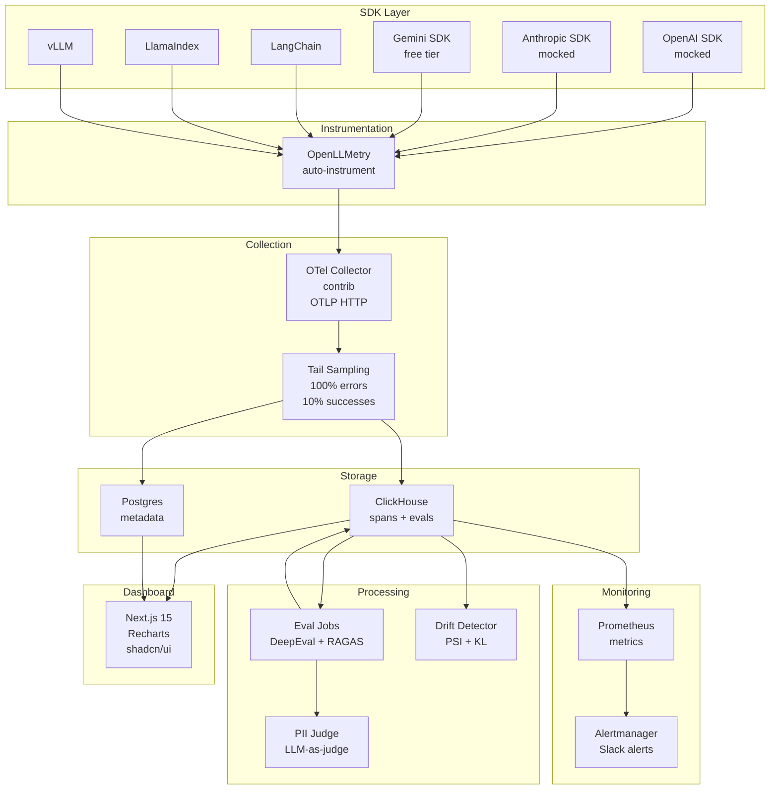

# LLM Observability & Eval Dashboard - Plan

## Goal Capsule

Build a self-hosted LLM Observability & Eval Dashboard as a portfolio project. The dashboard ingests traces from 6 SDK families via OpenTelemetry GenAI semantic conventions, stores them in ClickHouse, runs eval jobs (DeepEval, RAGAS, LLM-judge), detects prompt drift via PSI/KL divergence, and fires alerts through Prometheus/Alertmanager. A Next.js 15 dashboard with Recharts visualizes everything. The project ships as a one-command Docker Compose setup with an attractive GitHub README featuring architecture diagrams, screenshots, and setup documentation.

**Learning goal:** By project completion, the builder understands every architectural decision at the level of a senior engineer who can defend each choice in an interview. This means understanding not just *what* was built, but *why* each technology was chosen, *why* the architecture is structured this way, and *what would break* if a different choice were made.

- **Authority hierarchy:** The capstone spec is the source of truth for architecture and feature scope. User decisions (mock strategy, SDK coverage, GitHub polish priority) override spec defaults where they conflict.
- **Stop conditions:** All 6 SDK families produce canonical GenAI spans landing in ClickHouse. Dashboard shows real-time metrics. Eval jobs score traces. Drift detection fires on PSI > 0.2. Regression probe catches injected PII leak in <5 minutes. README is publication-ready.
- **Execution profile:** Phased build — infrastructure first, then ingestion, storage, dashboard, evals, drift, alerting, regression probe, and finally GitHub polish.
- **Tail ownership:** This is a standalone portfolio project. No upstream team owns it beyond the builder.

---

## System Design Learning Guide

This section is the **core educational foundation**. Before writing any code, you must understand these concepts at a deep level. Each system design topic maps to the implementation units that follow.

### Why Observability Exists

**The problem:** When you deploy an LLM-powered application (a chatbot, a RAG pipeline, an AI agent), you lose visibility into what happens inside the model. You send a prompt, you get a response, but you don't know:
- How much it cost (token pricing varies by model and provider)
- Whether the response was faithful to the context
- Whether the model hallucinated
- Whether the model leaked PII
- Whether the input distribution has drifted since last week
- Whether the latency is within your SLO

**The solution:** Observability = **logging structured traces** + **evaluating quality** + **detecting drift** + **alerting on anomalies**. This is exactly what this project builds.

**Interview answer:** "LLM observability is the practice of instrumenting LLM applications with structured tracing, automated evaluation, drift detection, and alerting — the same way we instrument web applications with APM tools like Datadog or New Relic, but specialized for the unique failure modes of probabilistic AI systems."

### Why OpenTelemetry

**The problem:** Each LLM provider (OpenAI, Anthropic, Google) has its own SDK, its own response format, and its own metrics. If you instrument each one differently, you get:
- No unified view across providers
- No portable schema (vendor lock-in)
- No standard way to correlate traces across services

**The solution:** OpenTelemetry (OTel) is the **CNCF standard** for distributed tracing. It provides:
- A **semantic convention** (schema) for span attributes — in 2025, OTel published `gen_ai.*` attributes specifically for LLM tracing
- **Auto-instrumentation** libraries (OpenLLMetry) that wrap SDK calls and emit standard spans
- A **collector** that receives, processes, and exports spans to any backend

**Why not just use Langfuse SDK directly?** Because Langfuse is a platform, not a standard. If you build on Langfuse's proprietary schema, switching to another platform requires rewriting everything. OpenTelemetry is the *lingua franca* — spans emitted with OTel can go to Langfuse, Phoenix, Datadog, Honeycomb, or your own ClickHouse.

**Interview answer:** "OpenTelemetry is the CNCF standard for distributed tracing. The GenAI semantic conventions (`gen_ai.*` attributes) give us a vendor-neutral schema for LLM spans. This means our instrumentation works with any observability backend — we're not locked into Langfuse or Phoenix."

### Why ClickHouse (Not Postgres) for Traces

**The problem:** LLM traces are high-volume (thousands per second), append-heavy (rarely updated), and queried analytically (aggregations over time ranges, GROUP BY model, percentiles). Postgres is optimized for OLTP (transactional, row-level, ACID). ClickHouse is optimized for OLAP (analytical, columnar, compression).

**The numbers:**
- ClickHouse compresses trace data 92% (3.4 TiB → 275 GiB in Langfuse's case)
- Sub-second aggregations over billions of spans
- Write throughput: 100K+ inserts/second on a single node
- Postgres would hit IOPS exhaustion at ~1K inserts/second for this workload

**Why not just use ClickHouse for everything?** Because ClickHouse doesn't support efficient row updates (it uses `ReplacingMergeTree` with eventual dedup). You need Postgres for transactional data: user accounts, API keys, project settings, model pricing tables — things that get updated in-place and need ACID guarantees.

**The architecture:** ClickHouse for OLAP (traces, evals, metrics), Postgres for OLTP (metadata, users, configs). This is exactly what Langfuse, Helicone, and SigNoz all converged on.

**Interview answer:** "We use a dual-database architecture: ClickHouse for trace analytics (columnar, compressed, fast aggregations) and Postgres for transactional metadata (users, API keys, pricing). This matches what production platforms like Langfuse have converged on — 92% compression on trace data, sub-second queries over millions of spans."

### Why the OTel Collector (Not Direct Export)

**The problem:** If your SDK exports directly to ClickHouse, you have:
- No sampling (store everything = expensive)
- No fan-out (can't send to multiple backends)
- No batching (individual inserts = slow)
- No memory management (OOM risk under load)

**The solution:** The OTel Collector sits between your SDKs and your storage:
- **Tail sampling:** Decides to keep or drop a trace *after* it completes — so you can peek at errors and keep 100% of them while sampling 10% of successes
- **Batching:** Groups spans into bulk inserts (5000+ rows per INSERT)
- **Fan-out:** Send to ClickHouse AND S3 AND Prometheus simultaneously
- **Memory limiter:** Prevents OOM under spike traffic

**Why tail sampling, not head sampling?** Head sampling decides at span creation whether to trace — you can't know if an error will occur later. Tail sampling waits for the full trace to complete, then decides. This means you **never lose error traces**.

**Interview answer:** "The OTel Collector provides tail-sampling — it waits for a trace to complete before deciding whether to keep it. This means we always keep 100% of error traces while sampling 10% of successes, giving us perfect error visibility with controlled storage costs."

### Why Docker Compose (Not Kubernetes)

**The problem:** Kubernetes is powerful but complex. For a solo portfolio project, you need:
- One-command startup (`docker compose up`)
- No cluster management
- No Helm charts, no manifests, no kubectl
- Fast iteration (change config, restart)

**Docker Compose gives you:** 7 services orchestrated with a single YAML file. Named volumes for persistence. Health checks. Port mapping. Dependency ordering. This is the right complexity level for a portfolio project.

**When you'd use Kubernetes:** At scale (hundreds of nodes), with a team (DevOps), for production (auto-scaling, rolling updates). None of those apply here.

**Interview answer:** "Docker Compose is the right deployment model for a self-hosted portfolio project — one command starts everything. Kubernetes adds operational complexity without demonstrating additional engineering skill for a solo project."

### Why Recharts (Not D3 or Chart.js)

**The problem:** You need charts in a React/Next.js dashboard. Options:
- **D3.js:** Maximum flexibility, maximum complexity. You build everything from scratch.
- **Chart.js:** Simple, but not React-native. Wrapper libraries exist but are clunky.
- **Recharts:** React-native, declarative, SSR-compatible, good defaults.

**Recharts wins** because: it's built on React components (not a canvas wrapper), it's SSR-compatible (no `window` errors in Server Components), and it has all the chart types you need (Area, Line, Bar, Composed). The declarative API means you describe *what* the chart should show, not *how* to draw it.

**Interview answer:** "Recharts is a React-native charting library that works with Server Components and SSR. Its declarative API fits the Next.js App Router pattern — you describe the data and the chart type, and Recharts handles the rendering."

### Why Eval Jobs Are Batch (Not Real-Time)

**The problem:** LLM evaluation is expensive (each eval calls another LLM as judge) and slow (seconds per evaluation). If you eval every trace in real-time:
- Cost explodes (thousands of eval calls per minute)
- Latency adds up (eval adds 2-5s to every request)
- Most traces are boring (routine completions don't need eval)

**The solution:** Batch eval jobs run every 15 minutes on *sampled* traces:
- Read the last 15 minutes of traces from ClickHouse
- Sample 10-20% (configurable)
- Run DeepEval metrics on the sample
- Write eval scores back as linked spans

**Why 15 minutes?** It's a balance: frequent enough to catch regressions quickly, infrequent enough to control costs. The regression probe demonstrates <5 minute MTTR, which fits within two eval cycles.

**Interview answer:** "Eval jobs run in batch on sampled traces every 15 minutes. This balances evaluation coverage against cost — evals are expensive (each one calls another LLM), so we sample rather than evaluate every trace."

### Why PSI for Drift Detection

**The problem:** Your LLM application's input distribution can drift over time:
- Users start asking different questions
- New jargon appears in prompts
- The embedding space shifts

If the input distribution drifts too far from what the model was trained on, response quality degrades silently.

**The solution:** Population Stability Index (PSI) compares two distributions:
- **Baseline:** This week's prompt embeddings (pooled, 4-week average)
- **Current:** Last 7 days of prompt embeddings
- **PSI > 0.2:** Warning — distributions are diverging
- **PSI > 0.25:** Critical — investigate immediately

**Why embeddings, not raw text?** Because PSI needs numerical distributions. sentence-transformers (`all-MiniLM-L6-v2`) converts text to 384-dimensional vectors, then we compute PSI per dimension and average.

**Interview answer:** "PSI measures how much a distribution has shifted compared to a baseline. We embed prompts using sentence-transformers, then compute PSI on the embedding distributions. PSI > 0.2 signals meaningful drift that warrants investigation."

### Why Prometheus + Alertmanager (Not Custom)

**The problem:** You need to:
- Export metrics (eval scores, latency percentiles)
- Evaluate alert rules (is faithfulness < 0.6?)
- Route alerts to Slack/PagerDuty
- Handle alert grouping, deduplication, and silence

Building this from scratch is months of work. Prometheus + Alertmanager is the industry standard — battle-tested at every scale.

**The flow:** Your Next.js app exports metrics as Prometheus exposition format → Prometheus scrapes every 15s → Alertmanager evaluates rules → routes to Slack/PagerDuty based on severity.

**Interview answer:** "Prometheus + Alertmanager is the industry standard for metric-based alerting. We export eval scores as Prometheus gauges and latency as histograms. Alertmanager handles routing, grouping, and deduplication — things that are surprisingly hard to get right from scratch."

---

## Product Contract

### Summary

A self-hosted LLM observability platform that ingests OpenTelemetry GenAI semconv traces from OpenAI, Anthropic, Google GenAI (Gemini), LangChain, LlamaIndex, and vLLM, stores them in ClickHouse + Postgres, runs DeepEval/RAGAS eval jobs over sampled traces, detects prompt drift via PSI on sentence-transformer embeddings, and fires Prometheus alerts to Slack. A Next.js 15 dashboard with Recharts visualizes spans/sec, cost/user, p95 latency, eval score trends, and drift status. Gemini free tier provides real traces; OpenAI/Anthropic use mocked completions to control costs. A regression probe demonstrates <5 minute MTTR on injected PII leaks.

### Problem Frame

Every AI team running production LLM traffic in 2026 maintains an observability plane alongside the model — cost attribution, hallucination detection, drift monitoring, jailbreak signal, SLO dashboards, PII leak alerts. The open-source references (Langfuse, Phoenix, OpenLLMetry) converged on OpenTelemetry GenAI semantic conventions as the ingest schema. Building a self-hosted dashboard that ingests from multiple SDK families, runs eval jobs, detects drift, and alerts demonstrates the full stack of AI engineering skills: OTel instrumentation, columnar storage, batch eval pipelines, embedding-based drift detection, real-time dashboards, and alerting infrastructure.

### Requirements

#### Ingestion & SDK Coverage

- R1. The system ingests OTLP HTTP traces from OpenAI, Anthropic, Google GenAI (Gemini), LangChain, LlamaIndex, and vLLM using OpenLLMetry auto-instrumentation.
- R2. Each SDK produces canonical GenAI semconv spans with attributes: `gen_ai.provider.name`, `gen_ai.request.model`, `gen_ai.usage.input_tokens`, `gen_ai.usage.output_tokens`, `gen_ai.response.id`, and `gen_ai.operation.name`.
- R3. A test script per SDK verifies that spans land in ClickHouse with correct `gen_ai.*` attributes.
- R4. Gemini uses real free-tier API calls. OpenAI and Anthropic use mocked completions with real OTLP span emission.

#### Storage

- R5. ClickHouse stores all spans with columns mirroring GenAI semconv: provider, model, input_tokens, output_tokens, latency_ms, trace_id, parent_span_id, status, timestamp.
- R6. ClickHouse has secondary bloom-filter indexes on user_id, app_id, model, and conversation_id for fast filtering.
- R7. Postgres stores metadata: users, projects, API keys, model pricing lookup table.
- R8. A materialized view aggregates spans-per-second, p95 latency, and cost per model per minute for dashboard performance.

#### Dashboard

- R9. Next.js 15 App Router dashboard with 6 pages: Overview, Traces, Trace Detail, Evals, Drift, Alerts.
- R10. Overview page shows: spans/sec, cost/user, p95 latency as KPI cards, plus time-series charts.
- R11. Traces page shows searchable/filterable trace table with drill-down to waterfall view.
- R12. Evals page shows faithfulness trend (line chart), toxicity breakdown (bar chart), model comparison table.
- R13. Drift page shows PSI over time with threshold lines at 0.2 and 0.25.
- R14. Alerts page shows active alerts table and alert history timeline.
- R15. Dark mode by default using Tailwind CSS v4 + next-themes.
- R16. Responsive layout: sidebar navigation, collapsible on mobile.

#### Evals

- R17. A scheduled batch job reads the last 15 minutes of sampled traces from ClickHouse and runs DeepEval faithfulness, toxicity, and answer relevancy metrics.
- R18. Eval results write back to ClickHouse as eval spans linked to the parent trace.
- R19. A custom PII-leak LLM-judge scores responses for PII exposure; high-score responses land in a triage queue.
- R20. RAGAS retrieval metrics (context precision, context recall) run on traces that carry retrieval context.

#### Drift Detection

- R21. A weekly job computes PSI between the current week's pooled prompt embeddings and a trailing 4-week baseline using sentence-transformers (all-MiniLM-L6-v2).
- R22. PSI > 0.2 triggers a warning alert. PSI > 0.25 triggers a critical alert.
- R23. KL divergence is computed as a secondary drift metric.

#### Alerting

- R24. Prometheus scrapes eval score aggregates and latency percentiles from the dashboard backend.
- R25. Alertmanager routes severity=warning to Slack and severity=critical to PagerDuty.
- R26. Alert rules cover: low faithfulness, high hallucination rate, p95 latency breach, prompt drift detected, daily budget burn.

#### Regression Probe

- R27. A regression probe injects a bug: the evaluated chatbot starts leaking fake SSNs 1% of the time.
- R28. The system catches the regression and fires a Slack alert within 5 minutes of injection.
- R29. MTTR (mean time to resolution) is measured and displayed on the dashboard.

#### GitHub Presentation

- R30. README includes: project title, tagline, architecture diagram (Mermaid), screenshots of all 6 dashboard pages, badge wall, quick-start guide, detailed setup instructions, tech stack description, and contributor guide.
- R31. Architecture diagrams show the full data flow: SDKs → OTel Collector → ClickHouse/Postgres → Evals/Drift/Alerting → Dashboard.
- R32. Screenshots are actual dashboard captures, not mockups.
- R33. A CONTRIBUTING.md file with development setup instructions.
- R34. Docker Compose one-command startup: `docker compose up`.

### Scope Boundaries

#### Deferred to Follow-Up Work

- Kubernetes deployment manifests and Helm charts
- Real payment/cost tracking integration
- Multi-tenant organization management
- Custom dashboard builder / drag-and-drop
- Haystack framework SDK instrumentation
- Per-app drift trails (drill-down by app_id)
- Tail-sampling policy with toxicity > 0.5 bias
- Phoenix evaluator swap comparison

#### Outside This Product's Identity

- Full production deployment with CI/CD pipelines
- Real PagerDuty integration (Slack webhook only for demo)
- S3 raw event archive (simplified to ClickHouse-only for this project)
- Redis event queue (not needed for single-node self-hosted)

---

## Planning Contract

### Key Technical Decisions

KTD-1. **OpenLLMetry for auto-instrumentation.** Use Traceloop's OpenLLMetry SDK (`traceloop-sdk` for Python) rather than manual OTel instrumentation. OpenLLMetry is the de-facto standard, Apache-2.0 licensed, and emits canonical `gen_ai.*` attributes automatically. Manual instrumentation would take 5x longer for no resume benefit.

KTD-2. **ClickHouse as primary trace store (not Postgres for traces).** Follow Langfuse's architecture: ClickHouse for OLAP trace analytics, Postgres for transactional metadata. ClickHouse's columnar storage gives 92% compression on trace data and sub-second aggregations over millions of spans. Postgres cannot handle the write volume or analytical query patterns.

KTD-3. **Tail-sampling in OTel Collector, not at SDK level.** The OTel Collector's tail-sampling processor keeps 100% of errored traces and 10% of successes. This is cost-effective and follows the spec's recommendation. SDK-level sampling loses error traces before they reach the collector.

KTD-4. **Gemini free tier for real traces, mocks for OpenAI/Anthropic.** The user has no budget for OpenAI/Anthropic API calls. OpenAI and Anthropic SDKs will emit real OTLP spans with mocked completions (pre-recorded responses). Gemini free tier provides real traces. This keeps the trace schema authentic while controlling costs to ~$0.

KTD-5. **Next.js 15 App Router with Server Components for data fetching.** Server Components fetch from ClickHouse at the top level; Client Components handle live polling and Recharts charts. This avoids the waterfall problem and follows Next.js 15 best practices. `@clickhouse/client` (official, v1.20) is the ClickHouse driver.

KTD-6. **Docker Compose for deployment (not Kubernetes).** One-command `docker compose up` is the right deployment model for a portfolio project. 7 services: ClickHouse, Postgres, Next.js app, OTel Collector (contrib), Prometheus, Alertmanager. Kubernetes adds complexity without resume benefit for a solo project.

KTD-7. **DeepEval as primary eval engine, RAGAS for retrieval metrics.** DeepEval v4 supports faithfulness, toxicity, answer relevancy, hallucination, and custom G-Eval criteria. RAGAS 0.2 adds context precision/recall for RAG traces. They compose well via DeepEval's `RagasMetric` wrapper.

KTD-8. **sentence-transformers for embedding-based drift detection.** Use `all-MiniLM-L6-v2` (free, fast, 384-dim) for prompt embeddings. Compute PSI by binning each embedding dimension. Threshold: PSI > 0.2 = warning, > 0.25 = critical. This follows the spec's drift detection approach.

KTD-9. **Prometheus + Alertmanager (not custom alerting).** The spec explicitly calls for Prometheus Alertmanager. Export eval scores and latency as Prometheus gauges/histograms from the Next.js backend. Alertmanager routes to Slack webhook. This is the standard production pattern.

KTD-10. **shadcn/ui + Tailwind CSS v4 + Recharts for dashboard.** shadcn/ui provides pre-built components (Card, Table, Badge, Sidebar, Chart). Tailwind v4 has the fastest builds. Recharts v3.9 is SSR-compatible with Next.js and supports all chart types needed (Area, Line, Bar, Composed).

### High-Level Technical Design

### Assumptions

- The user has Docker installed and can run `docker compose up`.
- Gemini free tier provides sufficient quota for demo traces (limited but enough for 6 SDK families).
- OpenAI and Anthropic mock responses are pre-recorded JSON files that produce realistic token counts and response shapes.
- The ClickHouse exporter auto-creates the `otel_traces` schema on first write; no manual schema migration needed for traces.
- Prometheus scrape interval of 15s is sufficient for dashboard metrics.

### Sequencing

The project builds in 10 phases, each producing a testable increment:

1. **Infrastructure** — Docker Compose with ClickHouse, Postgres, OTel Collector
2. **ClickHouse Schema** — Custom spans table, materialized views, indexes
3. **SDK Instrumentation** — OpenAI (mocked) → Anthropic (mocked) → Gemini (real) → LangChain → LlamaIndex → vLLM
4. **Ingestion Verification** — Test script per SDK, verify spans land in ClickHouse
5. **Next.js Dashboard Core** — App Router shell, ClickHouse client, Overview page
6. **Dashboard Pages** — Traces, Trace Detail, Evals, Drift, Alerts pages
7. **Eval Jobs** — DeepEval batch job, custom PII judge, RAGAS retrieval metrics
8. **Drift Detection** — Weekly PSI/KL job, sentence-transformers embeddings
9. **Alerting** — Prometheus metrics export, Alertmanager config, Slack webhook
10. **Regression Probe + GitHub Polish** — Injected PII bug, MTTR measurement, README, screenshots

---

## Implementation Units

### Unit Index

| Unit | Title | Files | Depends On |
|------|-------|-------|------------|
| U1 | Docker Compose infrastructure | `docker-compose.yml`, `.env.example` | — |
| U2 | ClickHouse schema and materialized views | `sql/`, `otel-collector-config.yaml` | U1 |
| U3 | OTel Collector configuration | `otel-collector-config.yaml` | U1 |
| U4 | OpenAI SDK instrumentation (mocked) | `sdk-clients/openai/`, `mocks/openai/` | U2, U3 |
| U5 | Anthropic SDK instrumentation (mocked) | `sdk-clients/anthropic/`, `mocks/anthropic/` | U2, U3 |
| U6 | Gemini SDK instrumentation (free tier) | `sdk-clients/gemini/` | U2, U3 |
| U7 | LangChain + LlamaIndex + vLLM instrumentation | `sdk-clients/langchain/`, `sdk-clients/llamaindex/`, `sdk-clients/vllm/` | U2, U3 |
| U8 | SDK verification test suite | `tests/sdk-verification/` | U4–U7 |
| U9 | Next.js app shell and ClickHouse client | `dashboard/`, `lib/clickhouse.ts` | U1 |
| U10 | Overview dashboard page | `dashboard/app/(app)/dashboard/` | U9 |
| U11 | Traces + Trace Detail pages | `dashboard/app/(app)/traces/` | U10 |
| U12 | Evals dashboard page | `dashboard/app/(app)/evals/` | U10 |
| U13 | Drift dashboard page | `dashboard/app/(app)/drift/` | U10 |
| U14 | Alerts dashboard page | `dashboard/app/(app)/alerts/` | U10 |
| U15 | DeepEval batch eval job | `eval-jobs/deepeval/` | U2 |
| U16 | Custom PII leak LLM-judge | `eval-jobs/pii-judge/` | U15 |
| U17 | RAGAS retrieval metrics | `eval-jobs/ragas/` | U15 |
| U18 | Drift detection job | `drift-detector/` | U2 |
| U19 | Prometheus metrics export | `dashboard/app/api/metrics/`, `prometheus.yml` | U10 |
| U20 | Alertmanager configuration | `alertmanager.yml`, `prometheus/alert_rules.yml` | U19 |
| U21 | Regression probe | `tests/regression/` | U15, U16, U20 |
| U22 | GitHub README and documentation | `README.md`, `CONTRIBUTING.md`, `docs/` | All |
| U23 | Screenshots and architecture diagrams | `docs/screenshots/`, Mermaid in README | U10–U14 |

### U1. Docker Compose Infrastructure

**What you'll learn:** Container orchestration, service dependencies, health checks, networking between containers.

**System design context:** Every microservice architecture needs a way to start, stop, and connect services. Docker Compose is the simplest orchestration tool — it reads a YAML file and starts all services with correct networking. Health checks ensure services are ready before dependent services start. Named volumes persist data across restarts.

- **Goal:** Establish the complete local development stack with all services orchestrated via Docker Compose.
- **Files:** `docker-compose.yml`, `.env.example`, `Makefile`
- **Patterns:** Follow the Langfuse self-hosted Docker Compose pattern. 7 services: ClickHouse (24.8), Postgres (16-alpine), Next.js app (custom build), OTel Collector (contrib 0.108+), Prometheus (v2.53), Alertmanager (v0.27). Named volumes for data persistence. Health checks on ClickHouse and Postgres.
- **Approach:** Write `docker-compose.yml` with all service definitions, port mappings, volume mounts, and dependency chains. Create `.env.example` with all required environment variables. Create a `Makefile` with shortcuts: `make up`, `make down`, `make logs`, `make seed`.
- **Test Scenarios:**
  - `docker compose up` starts all 7 services without errors
  - ClickHouse health check passes within 10 seconds
  - Postgres health check passes within 10 seconds
  - OTel Collector starts and exposes health endpoint on :13133
  - All ports are accessible: ClickHouse :8123, Postgres :5432, Next.js :3000, OTel :4318, Prometheus :9090, Alertmanager :9093
- **Verification:** `docker compose ps` shows all services healthy. `curl http://localhost:13133` returns 200.

### U2. ClickHouse Schema and Materialized Views

**What you'll learn:** Columnar database design, materialized views for pre-aggregation, bloom filter indexes, the tradeoff between OLTP and OLAP.

**System design context:** ClickHouse is a columnar OLAP database. Unlike Postgres (row-oriented, optimized for point reads/writes), ClickHouse stores data by column — so querying `SELECT avg(latency_ms) FROM spans WHERE model = 'gpt-4o'` only reads the `latency_ms` and `model` columns, not entire rows. Materialized views pre-compute aggregations so the dashboard doesn't recalculate from raw data every time. Bloom filter indexes speed up point lookups on high-cardinality columns.

- **Goal:** Create the ClickHouse schema for span storage with materialized views for dashboard performance.
- **Files:** `sql/create_spans_table.sql`, `sql/create_eval_spans_table.sql`, `sql/create_materialized_views.sql`, `sql/seed_model_pricing.sql`
- **Patterns:** Use the OTel ClickHouse exporter's auto-creation for `otel_traces`, but add a custom `eval_spans` table for eval results. Use `SummingMergeTree` for the materialized view aggregating spans-per-second. Use `ReplacingMergeTree` for eval spans (dedup on re-evaluation). Add bloom-filter skip indexes on user_id, app_id, model, conversation_id.
- **Approach:** Define the `otel_traces` schema explicitly (overriding exporter defaults for better LLM-specific columns). Create `eval_spans` table with columns: trace_id, span_id, metric_name, score, reason, model_used, timestamp. Create materialized view `spans_per_sec_mv` aggregating count, p95 latency, total cost per minute per model. Seed a `model_pricing` table with 2026 pricing for GPT-4o, Claude 3.5, Gemini models.
- **Test Scenarios:**
  - `SELECT count() FROM otel_traces` returns 0 (table exists, empty)
  - `SELECT count() FROM eval_spans` returns 0
  - Insert a test span, verify materialized view updates within 5 seconds
  - Bloom filter index on model column works: `SELECT * FROM otel_traces WHERE model = 'gpt-4o'` uses index
- **Verification:** ClickHouse client connects and all tables/views exist. Insert + query roundtrip works.

### U3. OTel Collector Configuration

**What you'll learn:** Distributed tracing pipeline, tail sampling vs head sampling, memory management, batching strategies.

**System design context:** The OTel Collector is the "traffic controller" of your observability pipeline. It receives spans from all SDKs, applies processing (sampling, batching, memory limiting), and exports to storage. Tail sampling is critical — it waits for a full trace to complete before deciding whether to keep it, ensuring error traces are never lost. Memory limiting prevents OOM under spike traffic.

- **Goal:** Configure the OpenTelemetry Collector with OTLP HTTP receiver, tail-sampling, and ClickHouse exporter.
- **Files:** `otel-collector-config.yaml`
- **Patterns:** Use `otelcol-contrib` distribution (required for ClickHouse exporter). Tail-sampling policies: keep 100% of errored traces, 10% of successes, keep traces with latency > 5000ms. Memory limiter to prevent OOM. Use exporter's internal batching (`sending_queue.batch`).
- **Approach:** Write the collector config with: OTLP HTTP receiver on :4318, memory limiter (1500MB limit), tail-sampling with three policies, ClickHouse exporter pointing to `clickhouse:8123`, Prometheus exporter on :8889 for collector self-metrics, health check on :13133, zpages on :55679.
- **Test Scenarios:**
  - Collector starts without config errors
  - `curl http://localhost:13133` returns healthy
  - `curl http://localhost:8889/metrics` returns Prometheus metrics
  - Send a test OTLP span via curl, verify it appears in ClickHouse within 10 seconds
- **Verification:** `docker compose logs otel-collector` shows no errors. Test span queryable in ClickHouse.

### U4. OpenAI SDK Instrumentation (Mocked)

**What you'll learn:** Auto-instrumentation, OTel span attributes, mock servers, the OpenAI response format.

**System design context:** OpenLLMetry wraps the OpenAI SDK and automatically creates OTel spans for every API call. The span captures the model name, token counts, latency, and response ID. Mocking lets you test the instrumentation without spending money — the mock returns realistic responses with correct token counts, so cost attribution works even though no real API call was made.

- **Goal:** Instrument OpenAI SDK with OpenLLMetry, using mocked completions to control costs.
- **Files:** `sdk-clients/openai/client.py`, `mocks/openai/chat_completion.json`, `sdk-clients/openai/run.py`
- **Patterns:** Use `traceloop-sdk` for auto-instrumentation. Mock responses stored as JSON files matching OpenAI's response format. The mock returns realistic token counts (input_tokens, output_tokens) so cost attribution works.
- **Approach:** Install `traceloop-sdk` and `opentelemetry-instrumentation-openai`. Initialize with `Traceloop.init()` and OTLP exporter pointing to `http://localhost:4318`. Create a mock server or patch `openai.ChatCompletion.create` to return pre-recorded responses. Run 10 test requests with varying models (gpt-4o, gpt-4o-mini). Verify spans land in ClickHouse with correct `gen_ai.provider.name=openai`, `gen_ai.request.model`, token counts.
- **Test Scenarios:**
  - 10 spans appear in ClickHouse after running the client
  - Each span has `gen_ai.provider.name=openai`
  - Each span has `gen_ai.request.model` set to gpt-4o or gpt-4o-mini
  - `gen_ai.usage.input_tokens` and `gen_ai.usage.output_tokens` are non-zero
  - No real API calls are made (mocked)
- **Verification:** `SELECT * FROM otel_traces WHERE spanAttributes['gen_ai.provider.name'] = 'openai'` returns 10 rows.

### U5. Anthropic SDK Instrumentation (Mocked)

**What you'll learn:** How different LLM providers produce different span shapes, how OpenLLMetry normalizes them.

**System design context:** Anthropic's SDK has a different API shape than OpenAI (Messages API vs Chat Completions API). OpenLLMetry normalizes both into the same `gen_ai.*` attribute schema. This normalization is the whole point of OpenTelemetry — different providers, same observability schema.

- **Goal:** Instrument Anthropic SDK with OpenLLMetry, using mocked completions.
- **Files:** `sdk-clients/anthropic/client.py`, `mocks/anthropic/message.json`, `sdk-clients/anthropic/run.py`
- **Patterns:** Same pattern as U4. Mock responses matching Anthropic's Messages API format.
- **Approach:** Install `opentelemetry-instrumentation-anthropic`. Mock `anthropic.Anthropic().messages.create`. Run 10 test requests. Verify spans with `gen_ai.provider.name=anthropic`.
- **Test Scenarios:**
  - 10 spans appear in ClickHouse with `gen_ai.provider.name=anthropic`
  - Token counts are realistic
  - No real API calls made
- **Verification:** Query ClickHouse for anthropic provider spans.

### U6. Gemini SDK Instrumentation (Free Tier)

**What you'll learn:** How to use free-tier APIs for real traces, rate limiting considerations.

**System design context:** Gemini's free tier provides real API calls with no cost. This gives you authentic traces — real response text, real token counts, real latency. The tradeoff is rate limits (typically 15 RPM, 1M tokens/day). For a demo project, this is more than enough.

- **Goal:** Instrument Google GenAI SDK with OpenLLMetry, using real Gemini free-tier API calls.
- **Files:** `sdk-clients/gemini/client.py`, `sdk-clients/gemini/run.py`
- **Patterns:** Use `opentelemetry-instrumentation-google-genai` or the `google-genai` package with OTel integration. Real API calls to Gemini free tier.
- **Approach:** Install `google-genai` and OTel instrumentation. Configure with `GEMINI_API_KEY`. Run 5 test requests with `gemini-1.5-flash` (cheapest model). Verify spans with `gen_ai.provider.name=gcp.gen_ai`.
- **Test Scenarios:**
  - 5 spans appear in ClickHouse with `gen_ai.provider.name=gcp.gen_ai`
  - Real response text is captured in span attributes
  - Token counts match actual Gemini usage
  - No errors from free-tier rate limits
- **Verification:** Query ClickHouse for Gemini spans. Verify real response content.

### U7. LangChain + LlamaIndex + vLLM Instrumentation

**What you'll learn:** How orchestration frameworks create nested spans, parent-child trace relationships.

**System design context:** LangChain and LlamaIndex are orchestration frameworks that wrap LLM calls. When you use LangChain to call OpenAI, you get TWO spans: a LangChain "chain" span (parent) and an OpenAI "LLM" span (child). This parent-child relationship is critical for understanding the full execution path — the waterfall view in the dashboard shows this hierarchy.

- **Goal:** Instrument the remaining 3 SDK families with OpenLLMetry.
- **Files:** `sdk-clients/langchain/run.py`, `sdk-clients/llamaindex/run.py`, `sdk-clients/vllm/run.py`
- **Patterns:** LangChain and LlamaIndex wrap OpenAI/Anthropic under the hood, so their spans appear as nested child spans. vLLM is a local model server — instrument with `opentelemetry-instrumentation-openai` pointing to the vLLM endpoint.
- **Approach:** Install `opentelemetry-instrumentation-langchain` and `opentelemetry-instrumentation-llamaindex`. For LangChain, create a simple chain that calls a mocked OpenAI model. For LlamaIndex, create a simple query engine. For vLLM, run a local model (or mock the vLLM OpenAI-compatible endpoint). Run 5 requests each. Verify spans with correct provider names.
- **Test Scenarios:**
  - LangChain spans show `gen_ai.provider.name=openai` (wraps OpenAI)
  - LlamaIndex spans show the underlying provider
  - vLLM spans show the correct provider
  - Parent-child span relationships are correct for LangChain/LlamaIndex
- **Verification:** Query ClickHouse for all 6 provider types.

### U8. SDK Verification Test Suite

**What you'll learn:** Integration testing patterns, polling for eventual consistency, test fixtures.

**System design context:** The OTel Collector processes spans asynchronously — there's a delay between sending a span and it appearing in ClickHouse. Tests must poll with a timeout rather than asserting immediately. This is a common pattern in distributed systems testing: wait for eventual consistency.

- **Goal:** Automated test suite verifying all 6 SDK families produce canonical GenAI spans.
- **Files:** `tests/sdk-verification/test_all_sdks.py`, `tests/sdk-verification/conftest.py`
- **Patterns:** pytest-based. Each SDK has a test function that runs N requests and asserts on ClickHouse query results. Uses `clickhouse-connect` for test assertions.
- **Approach:** Write a pytest suite that: (1) runs each SDK client, (2) waits for spans to appear in ClickHouse (poll with timeout), (3) asserts on provider name, model, token counts, trace_id presence, span_kind=CLIENT. Include a `conftest.py` with ClickHouse client fixture and test data setup/teardown.
- **Test Scenarios:**
  - All 6 SDK tests pass
  - Each test verifies ≥5 spans per SDK
  - Token counts are > 0 for all spans
  - Trace IDs are valid (hex string, correct length)
  - No test makes real API calls (mocked for OpenAI/Anthropic)
- **Verification:** `pytest tests/sdk-verification/ -v` passes all tests.

### U9. Next.js App Shell and ClickHouse Client

**What you'll learn:** Next.js App Router, Server Components vs Client Components, the singleton pattern for database clients, Tailwind CSS theming.

**System design context:** Next.js 15 App Router uses Server Components by default — they run on the server and can fetch data directly (no API layer needed). Client Components run in the browser and handle interactivity. The ClickHouse client is a singleton because creating a new HTTP connection for every query is expensive — reuse the connection pool.

- **Goal:** Set up the Next.js 15 App Router project with ClickHouse client, sidebar navigation, and dark mode.
- **Files:** `dashboard/package.json`, `dashboard/app/layout.tsx`, `dashboard/app/(app)/layout.tsx`, `dashboard/components/sidebar.tsx`, `dashboard/components/theme-provider.tsx`, `dashboard/lib/clickhouse.ts`, `dashboard/Dockerfile`
- **Patterns:** shadcn/ui initialization. Tailwind CSS v4 with dark mode via `next-themes`. ClickHouse singleton client using `@clickhouse/client`. Sidebar with navigation links to all 6 pages. Responsive layout: hidden sidebar on mobile, visible on lg+.
- **Approach:** Create Next.js 15 project with `npx create-next-app@latest`. Install shadcn/ui, tailwindcss, next-themes, recharts, @clickhouse/client. Set up the app shell with root layout (ThemeProvider), app layout (Sidebar + main content area). Create the ClickHouse client singleton with environment variable configuration.
- **Test Scenarios:**
  - `npm run dev` starts without errors
  - Dashboard renders at localhost:3000
  - Dark mode toggle works
  - Sidebar navigation links are present for all 6 pages
  - ClickHouse client connects successfully
- **Verification:** `npm run build` completes without errors. App loads in browser.

### U10. Overview Dashboard Page

**What you'll learn:** Server Component data fetching, parallel queries, live polling with Client Components, KPI card design.

**System design context:** The Overview page fetches data from ClickHouse using `Promise.all` for parallel queries — this avoids the waterfall problem (where each query waits for the previous one). Charts use Client Components with live polling (5s interval) because they need `useState` and `useEffect` for real-time updates. KPI cards show current values with trend indicators (up/down arrows).

- **Goal:** Build the Overview page with KPI cards and time-series charts.
- **Files:** `dashboard/app/(app)/dashboard/page.tsx`, `dashboard/components/kpi-card.tsx`, `dashboard/components/spans-chart.tsx`, `dashboard/components/latency-chart.tsx`, `dashboard/components/cost-chart.tsx`, `dashboard/lib/services/metrics.ts`
- **Patterns:** Server Component fetching from ClickHouse at top level via `Promise.all`. Client Components for Recharts charts with live polling (5s interval). KPI cards showing spans/sec, cost/user, p95 latency with trend indicators.
- **Approach:** Create `lib/services/metrics.ts` with ClickHouse queries for spans-per-sec, latency-p95, cost-per-user. Create the page as a Server Component that fetches all metrics in parallel. Create chart components as Client Components using Recharts AreaChart (spans/sec), LineChart (p95 latency), BarChart (cost by model). Add live polling for real-time updates.
- **Test Scenarios:**
  - Page renders with 3 KPI cards
  - Charts display data when spans exist in ClickHouse
  - Live polling updates charts every 5 seconds
  - Responsive: charts stack on mobile, grid on desktop
  - Dark mode renders correctly
- **Verification:** Page loads, KPI cards show values, charts render with data.

### U11. Traces + Trace Detail Pages

**What you'll learn:** Waterfall visualization, span hierarchy, CSS grid timelines, search/filter patterns.

**System design context:** A trace is a collection of spans that represent a single request's journey through your system. The waterfall view shows spans as horizontal bars on a timeline — the width represents duration, the nesting represents parent-child relationships. This is the same visualization used by Jaeger, Zipkin, and Datadog.

- **Goal:** Build the Traces search page and Trace Detail waterfall view.
- **Files:** `dashboard/app/(app)/traces/page.tsx`, `dashboard/app/(app)/traces/[id]/page.tsx`, `dashboard/components/trace-table.tsx`, `dashboard/components/trace-waterfall.tsx`, `dashboard/lib/services/traces.ts`
- **Patterns:** Search bar with filter dropdowns (status, model, time range). Table with sortable columns. Click row to navigate to trace detail. Waterfall view using CSS grid timeline showing span hierarchy.
- **Approach:** Create `lib/services/traces.ts` with queries for trace search (with filters) and trace waterfall (parent-child span hierarchy). Build the traces page with search bar, filter panel, and data table. Build trace detail page with waterfall timeline visualization showing span durations as horizontal bars.
- **Test Scenarios:**
  - Traces page shows table with trace data
  - Search filters work (by model, status, time range)
  - Clicking a trace navigates to detail page
  - Waterfall shows span hierarchy with correct durations
  - Back navigation works
- **Verification:** Traces page loads, search works, detail page shows waterfall.

### U12. Evals Dashboard Page

**What you'll learn:** Eval score visualization, trend analysis, model comparison patterns.

**System design context:** Eval scores are 0-1 values produced by LLM-as-judge or code-based evaluators. Visualizing them requires trend lines (is faithfulness improving or degrading?), category breakdowns (which toxicity categories are highest?), and model comparison (is GPT-4o more faithful than Claude?).

- **Goal:** Build the Evals page showing faithfulness trends, toxicity breakdown, and model comparison.
- **Files:** `dashboard/app/(app)/evals/page.tsx`, `dashboard/components/faithfulness-chart.tsx`, `dashboard/components/toxicity-chart.tsx`, `dashboard/components/model-comparison-table.tsx`, `dashboard/lib/services/evals.ts`
- **Patterns:** Line chart for faithfulness trend over 30 days. Horizontal bar chart for toxicity by category. Table comparing eval scores across models.
- **Approach:** Create `lib/services/evals.ts` with queries for faithfulness trend, toxicity scores, and model comparison from eval_spans table. Build chart components using Recharts.
- **Test Scenarios:**
  - Evals page renders with 3 sections
  - Faithfulness trend chart shows data when eval spans exist
  - Toxicity breakdown shows categories
  - Model comparison table lists all tested models
- **Verification:** Evals page loads with correct charts and data.

### U13. Drift Dashboard Page

**What you'll learn:** PSI visualization, threshold-based alerting, time-series with reference lines.

**System design context:** PSI is a single number (0 to ~1) that measures distribution shift. The dashboard shows PSI over time as bars, with horizontal reference lines at 0.2 (warning) and 0.25 (critical). When a bar crosses a threshold line, it's visually obvious that drift is happening.

- **Goal:** Build the Drift page showing PSI over time with threshold lines.
- **Files:** `dashboard/app/(app)/drift/page.tsx`, `dashboard/components/psi-chart.tsx`, `dashboard/components/drift-events-log.tsx`, `dashboard/lib/services/drift.ts`
- **Patterns:** ComposedChart with bars for PSI values and ReferenceLines at 0.2 and 0.25 thresholds. Drift events log table.
- **Approach:** Create `lib/services/drift.ts` with PSI trend query. Build ComposedChart with threshold lines. Add drift events log table.
- **Test Scenarios:**
  - Drift page renders with PSI chart
  - Threshold lines appear at 0.2 and 0.25
  - PSI bars render with correct values
  - Drift events log shows historical alerts
- **Verification:** Drift page loads with correct visualization.

### U14. Alerts Dashboard Page

**What you'll learn:** Alert lifecycle (firing → pending → resolved), severity routing, alert history patterns.

**System design context:** Alerts have three states: pending (condition met but not yet confirmed), firing (confirmed, alert sent), resolved (condition no longer met). The dashboard shows active alerts with severity badges (critical=red, warning=yellow) and a history timeline.

- **Goal:** Build the Alerts page showing active alerts and alert history.
- **Files:** `dashboard/app/(app)/alerts/page.tsx`, `dashboard/components/active-alerts-table.tsx`, `dashboard/components/alert-history-timeline.tsx`, `dashboard/lib/services/alerts.ts`
- **Patterns:** Table for active alerts with severity badges. Timeline chart for alert history.
- **Approach:** Create `lib/services/alerts.ts` querying Prometheus/Alertmanager API for active alerts and history. Build active alerts table and history timeline.
- **Test Scenarios:**
  - Alerts page renders with active alerts section
  - Alert history shows past alerts
  - Severity badges render correctly (critical=red, warning=yellow)
- **Verification:** Alerts page loads with correct data.

### U15. DeepEval Batch Eval Job

**What you'll learn:** LLM-as-judge pattern, batch processing, the cost/quality tradeoff in evaluation.

**System design context:** DeepEval uses an LLM (default: GPT-4) to evaluate another LLM's output. This is the "LLM-as-judge" pattern — the judge reads the prompt, response, and context, then scores on a rubric (faithfulness, toxicity, etc.). Running this in batch every 15 minutes on sampled traces balances coverage against cost.

- **Goal:** Build a scheduled batch job that reads sampled traces and runs DeepEval metrics.
- **Files:** `eval-jobs/deepeval/runner.py`, `eval-jobs/deepeval/requirements.txt`, `eval-jobs/deepeval/Dockerfile`
- **Patterns:** Python script using `clickhouse-connect` to read traces, `deepeval` to score them, and ClickHouse insert to write eval spans back. Runs every 15 minutes via cron or Docker Compose health check.
- **Approach:** Write a Python script that: (1) queries ClickHouse for traces from the last 15 minutes, (2) constructs `LLMTestCase` objects from trace data, (3) runs `FaithfulnessMetric`, `ToxicityMetric`, `AnswerRelevancyMetric`, (4) inserts eval results back as eval_spans. Include `requirements.txt` with deepeval, clickhouse-connect.
- **Test Scenarios:**
  - Script runs without errors
  - Reads traces from ClickHouse
  - Produces eval scores (0-1 range)
  - Writes eval spans back to ClickHouse
  - Eval spans link to parent trace via trace_id
- **Verification:** Run script, query eval_spans table, verify scores exist.

### U16. Custom PII Leak LLM-Judge

**What you'll learn:** Custom eval criteria, structured output from LLMs, sampling strategies for cost control.

**System design context:** PII detection is a custom eval — it's not a built-in DeepEval metric. You write a prompt that asks the judge LLM to detect PII, then parse the structured JSON response. Sampling 10% of traces controls cost while still providing coverage.

- **Goal:** Build a custom PII-leak judge that scores responses for PII exposure.
- **Files:** `eval-jobs/pii-judge/judge.py`, `eval-jobs/pii-judge/prompt.py`
- **Patterns:** LLM-as-judge pattern. Uses a cheap model (Gemini free tier or GPT-4o-mini) to score responses. Structured JSON output. Samples 10% of traces for cost control.
- **Approach:** Write a judge script that: (1) reads recent traces, (2) samples 10%, (3) sends each response to the guard LLM with a PII detection prompt, (4) parses JSON response for PII items and score, (5) writes high-score (PII detected) responses to a triage queue table. Include the prompt template as a separate module.
- **Test Scenarios:**
  - Judge runs without errors
  - Scores responses on 0-1 scale
  - Detects fake SSNs in test data
  - High-score responses are flagged in triage queue
  - Only 10% of traces are sampled
- **Verification:** Run judge, verify triage queue has flagged responses.

### U17. RAGAS Retrieval Metrics

**What you'll learn:** RAG evaluation, retrieval quality metrics, when to use RAGAS vs DeepEval.

**System design context:** RAGAS evaluates RAG (Retrieval-Augmented Generation) pipelines specifically. It measures whether the retrieved context was relevant (context precision) and whether it covered what was needed (context recall). These metrics only apply to traces that have retrieval context — plain chat completions don't have retrieval.

- **Goal:** Run RAGAS retrieval metrics on traces that carry retrieval context.
- **Files:** `eval-jobs/ragas/runner.py`
- **Patterns:** RAGAS metrics (context precision, context recall) only run on traces with `retrieval_context` attribute. Uses DeepEval's `RagasMetric` wrapper for compatibility.
- **Approach:** Write a script that: (1) queries ClickHouse for traces with retrieval context, (2) constructs test cases, (3) runs RAGAS metrics via DeepEval wrapper, (4) writes results as eval spans.
- **Test Scenarios:**
  - Script runs without errors
  - Only processes traces with retrieval context
  - Produces context precision and recall scores
  - Results link to parent traces
- **Verification:** Run script, verify RAGAS eval spans exist.

### U18. Drift Detection Job

**What you'll learn:** Embedding-based drift detection, PSI computation, the relationship between prompt distribution and model performance.

**System design context:** When users start asking different questions, the model's performance degrades because it's operating outside its training distribution. PSI measures this shift by comparing embedding distributions. sentence-transformers converts text to 384-dimensional vectors, then we bin each dimension and compare to a baseline.

- **Goal:** Build a weekly drift detection job computing PSI and KL divergence on prompt embeddings.
- **Files:** `drift-detector/detector.py`, `drift-detector/requirements.txt`, `drift-detector/Dockerfile`
- **Patterns:** sentence-transformers for embeddings, scipy for divergence metrics. Weekly schedule. Stores PSI scores in ClickHouse for dashboard visualization.
- **Approach:** Write a Python script that: (1) loads `all-MiniLM-L6-v2` model, (2) queries past 7 days of prompts from ClickHouse, (3) embeds all prompts, (4) computes PSI against the 4-week baseline (stored as numpy file or ClickHouse), (5) computes KL divergence, (6) inserts PSI/KL scores into a drift_scores table, (7) triggers alert if PSI > 0.2.
- **Test Scenarios:**
  - Script runs without errors
  - Embeddings are 384-dimensional vectors
  - PSI score is computed and > 0
  - KL divergence is computed and >= 0
  - Alert triggers when PSI > 0.2
- **Verification:** Run script, query drift_scores table, verify PSI values.

### U19. Prometheus Metrics Export

**What you'll learn:** Prometheus exposition format, gauge vs histogram vs counter, metric scraping.

**System design context:** Prometheus expects metrics in a specific text format: `metric_name{labels} value`. Gauges are single values (faithfulness score). Histograms track distributions (latency). Counters only go up (total tokens processed). The `/api/metrics` endpoint serves this format, and Prometheus scrapes it every 15s.

- **Goal:** Export eval scores and latency as Prometheus metrics from the Next.js backend.
- **Files:** `dashboard/app/api/metrics/route.ts`, `prometheus.yml`
- **Patterns:** Route Handler serving Prometheus text format. Gauges for eval scores, histograms for latency. Prometheus scrapes the Next.js app.
- **Approach:** Create a `/api/metrics` Route Handler that queries ClickHouse for current eval scores and latency percentiles, formats them as Prometheus exposition format, and returns with `text/plain` content type. Configure `prometheus.yml` to scrape `nextjs-app:3000/api/metrics`.
- **Test Scenarios:**
  - `/api/metrics` returns valid Prometheus text
  - Metrics include `llm_eval_faithfulness_score`, `llm_eval_toxicity_score`
  - Histogram includes `llm_request_duration_seconds`
  - Prometheus scrapes successfully
- **Verification:** `curl http://localhost:3000/api/metrics` returns Prometheus format. Prometheus targets page shows Next.js as UP.

### U20. Alertmanager Configuration

**What you'll learn:** Alert rule evaluation, routing trees, severity-based escalation, alert grouping.

**System design context:** Alertmanager receives alerts from Prometheus and routes them based on severity and labels. Warning alerts go to Slack (informational). Critical alerts go to PagerDuty (requires action). Alert grouping prevents spam — if 10 instances of the same alert fire, they're grouped into one notification.

- **Goal:** Configure Alertmanager with alert rules and Slack routing.
- **Files:** `alertmanager.yml`, `prometheus/alert_rules.yml`
- **Patterns:** Alert rules in Prometheus config. Alertmanager routes warnings to Slack, criticals to PagerDuty (mocked for demo). Group by alertname and service.
- **Approach:** Write `alert_rules.yml` with rules for: LowFaithfulness (< 0.6), HighHallucinationRate (< 0.5), P95LatencyBreach (> 10s), PromptDriftDetected (PSI > 0.2), DailyBudgetBurn (> $100/day). Configure Alertmanager with Slack webhook receiver.
- **Test Scenarios:**
  - Prometheus loads alert rules without errors
  - Alert rules evaluate correctly against test data
  - Alertmanager receives firing alerts
  - Slack webhook is called for warning alerts
- **Verification:** Prometheus alerts page shows configured rules. Test with synthetic metric data.

### U21. Regression Probe

**What you'll learn:** End-to-end testing, MTTR measurement, the full observability pipeline in action.

**System design context:** The regression probe is the "final exam" — it injects a bug (fake SSNs in responses), then measures how long it takes the entire pipeline to catch it: ingestion → eval job → PII judge → alert → Slack notification. This demonstrates the value of the observability system in a concrete, measurable way.

- **Goal:** Build and execute a regression probe demonstrating <5 minute MTTR on injected PII leak.
- **Files:** `tests/regression/probe.py`, `tests/regression/README.md`
- **Patterns:** Inject a deliberate bug (fake SSN leaking in 1% of responses). Measure time from injection to Slack alert. Display MTTR on dashboard.
- **Approach:** Write a probe script that: (1) modifies the mock OpenAI responses to include fake SSNs in 1% of responses, (2) starts the ingestion, (3) starts the eval job, (4) measures time until PII judge flags the regression, (5) measures time until Slack alert fires, (6) calculates MTTR. Record the MTTR for the README.
- **Test Scenarios:**
  - Probe runs end-to-end without errors
  - Fake SSNs appear in mock responses
  - PII judge catches the regression
  - Slack alert fires within 5 minutes
  - MTTR is measured and recorded
- **Verification:** Run probe, verify MTTR < 5 minutes, verify Slack notification received.

### U22. GitHub README and Documentation

**What you'll learn:** Technical writing, architecture documentation, the importance of README quality for hiring managers.

**System design context:** The README is the first thing a hiring manager sees. It must demonstrate: (1) you understand the problem, (2) you made deliberate architectural choices, (3) you can communicate complex systems clearly. Mermaid diagrams show the architecture. Screenshots prove it works. Setup instructions show you care about developer experience.

- **Goal:** Create an attractive, comprehensive README and documentation for the GitHub repository.
- **Files:** `README.md`, `CONTRIBUTING.md`, `docs/architecture.md`, `docs/setup.md`
- **Patterns:** GitHub-flavored markdown. Mermaid diagrams. Badge wall. Step-by-step setup instructions. Architecture deep-dive. Tech stack description.
- **Approach:** Write README with: project title + tagline, badge wall (Docker, License, PRs Welcome, TypeScript, Python), architecture diagram (Mermaid), feature list, tech stack table, quick-start (3 commands), detailed setup guide, SDK coverage table, eval metrics explanation, dashboard screenshots, contributing guide, license.
- **Test Scenarios:**
  - README renders correctly on GitHub
  - Mermaid diagrams display properly
  - All links work
  - Setup instructions are accurate (tested from clean clone)
  - Screenshots are included and labeled
- **Verification:** Push to GitHub, verify README renders correctly.

### U23. Screenshots and Architecture Diagrams

**What you'll learn:** Visual documentation, diagramming systems architecture, the impact of visual communication.

**System design context:** Architecture diagrams are the "universal language" of system design. A good diagram communicates the data flow, component relationships, and design decisions in seconds — something that takes paragraphs of text to explain. Mermaid is the industry standard for code-based diagrams in GitHub.

- **Goal:** Capture actual dashboard screenshots and create architecture diagrams for the README.
- **Files:** `docs/screenshots/overview.png`, `docs/screenshots/traces.png`, `docs/screenshots/evals.png`, `docs/screenshots/drift.png`, `docs/screenshots/alerts.png`, `docs/screenshots/trace-detail.png`
- **Patterns:** Use headless browser or manual screenshots. Dark mode. Consistent viewport size. Mermaid diagrams for architecture, data flow, and component topology.
- **Approach:** Start the full stack, populate with test data, take screenshots of all 6 dashboard pages. Create Mermaid diagrams: system architecture, data flow, eval pipeline, drift detection flow.
- **Test Scenarios:**
  - All 6 screenshots captured
  - Screenshots show actual data (not empty states)
  - Mermaid diagrams render in GitHub README
  - Image files are optimized (< 500KB each)
- **Verification:** README displays all screenshots and diagrams correctly.

---

## Verification Contract

| Command | What it proves | When to run |
|---------|---------------|-------------|
| `docker compose up -d` | All 7 services start without errors | After U1 |
| `docker compose ps` | All services healthy | After U1 |
| `pytest tests/sdk-verification/ -v` | All 6 SDK families produce valid spans | After U8 |
| `npm run build` (in `dashboard/`) | Next.js builds without errors | After U9 |
| `npm run dev` (in `dashboard/`) | Dashboard renders all 6 pages | After U14 |
| `python eval-jobs/deepeval/runner.py` | Eval job produces scores | After U15 |
| `python eval-jobs/pii-judge/judge.py` | PII judge catches regressions | After U16 |
| `python drift-detector/detector.py` | Drift detection computes PSI | After U18 |
| `curl http://localhost:3000/api/metrics` | Prometheus metrics endpoint works | After U19 |
| `python tests/regression/probe.py` | MTTR < 5 minutes on injected regression | After U21 |
| `docker compose down -v && docker compose up` | Full stack restarts cleanly | Final |

---

## Definition of Done

### Global

- All 6 SDK families produce canonical GenAI spans landing in ClickHouse
- Dashboard shows real-time spans/sec, cost/user, p95 latency
- Eval jobs score traces with faithfulness, toxicity, and answer relevancy
- Drift detection computes PSI and alerts on threshold breach
- Alertmanager fires Slack alerts for critical conditions
- Regression probe demonstrates <5 minute MTTR
- `docker compose up` starts the entire stack
- README is publication-ready with architecture diagrams and screenshots
- No secrets committed to the repository

### Per-Unit

- Each unit's test scenarios pass
- Each unit is independently testable
- No unit leaves behind dead code or experimental artifacts

### Cleanup

- Remove any temporary test data generators that aren't part of the demo
- Remove any hardcoded test URLs or mock data that shouldn't be in the repo
- Verify `.env.example` has no real API keys
- Verify `.gitignore` excludes `.env`, `node_modules`, `__pycache__`, `.next`
